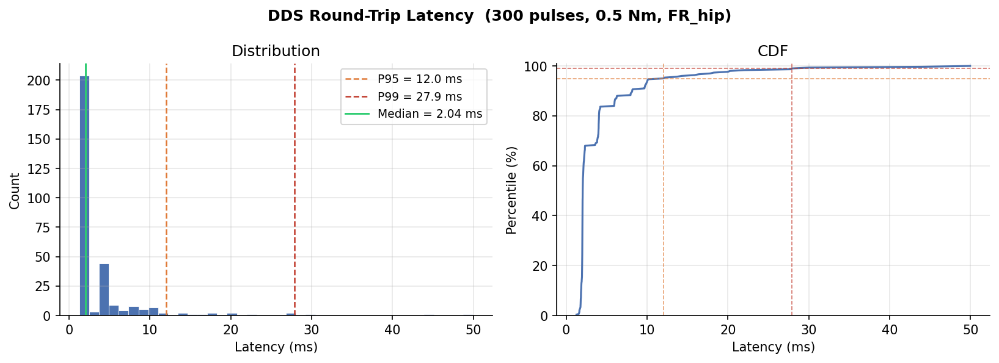
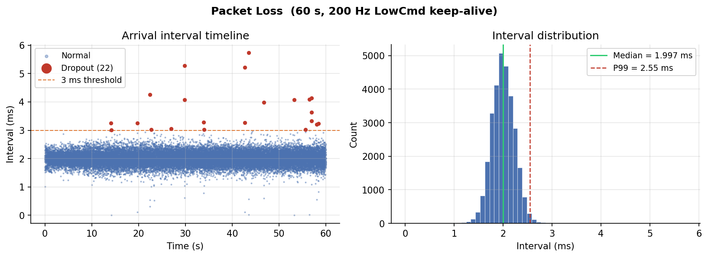
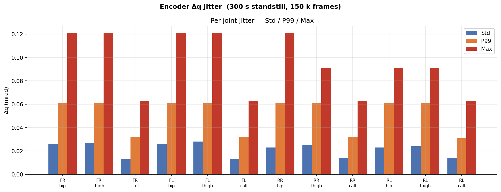
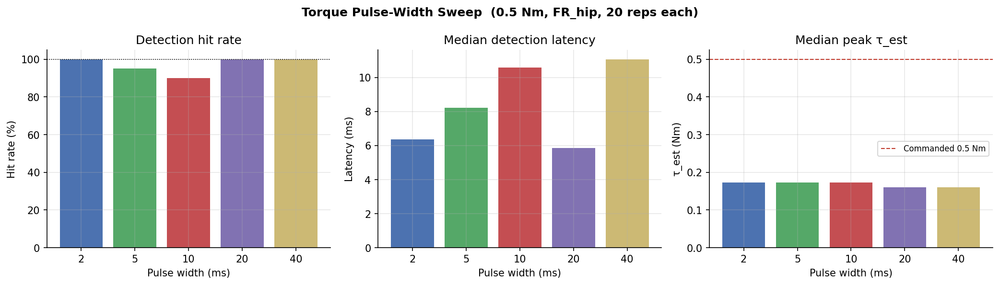
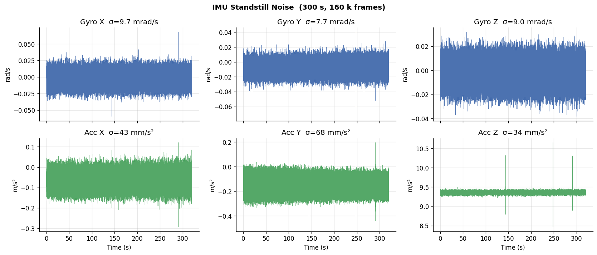
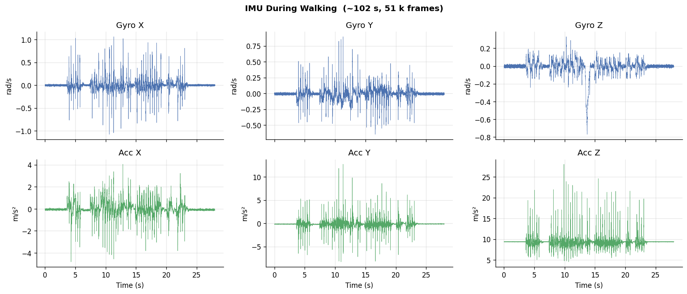
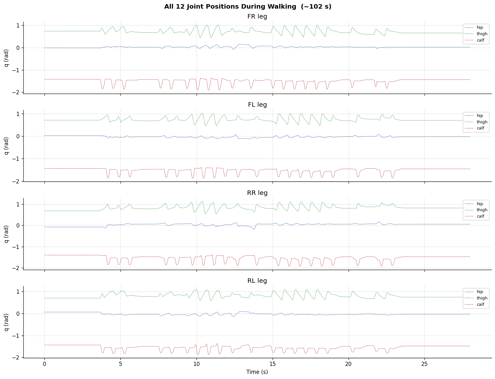

# Go2 Pro SDK Benchmark & Control Architecture Decision

**Hardware:** Unitree Go2 Pro · rooted · direct Gigabit Ethernet · Ubuntu host  
**Toolchain:** C++17 · Unitree SDK2 · CycloneDDS · SCHED\_FIFO · `mlockall`  
**Date:** 2026-05-24

---

## Overview

Six benchmark tests characterise the Go2 Pro's real-time DDS interface.
The results determine which control architecture is viable on this hardware.

Three architectures are possible depending on what the numbers show:

| Condition | Architecture |
|---|---|
| Latency median < 1 ms, jitter σ < 0.5 ms, packet loss < 0.1 % | EKF → MPC → **WBC at 500 Hz** |
| Latency median 1–3 ms, or jitter σ 0.5–1 ms | EKF → MPC → **Onboard PD** (WBC ruled out) |
| Latency median > 3 ms, or packet loss > 0.5 % | **Offboard MPC** at 20–30 Hz via sport\_client |

**Result: middle row. Architecture = EKF → wrapped MPC @50 Hz → onboard PD.**

---

## Tests

All tests run on a dedicated Gigabit Ethernet link. DDS callbacks at SCHED\_FIFO
priority 80. Memory locked via `mlockall`.

| Test | Script | Setup |
|---|---|---|
| Round-trip torque latency | `latency_v3_fix.cpp` | 300 pulses · 0.5 Nm · FR\_hip |
| Packet loss | `packet_loss_test.cpp` | 60 s · 200 Hz LowCmd keep-alive |
| Encoder jitter | `encoder_jitter.cpp` | 300 s standstill · ~150 k frames |
| Pulse width sweep | `pulse_sweep.cpp` | 5 widths × 20 reps · FR\_hip |
| IMU standstill noise | `imu_logger.cpp` | 300 s standstill · ~160 k frames |
| IMU + joints during walking | `imu_logger.cpp` | ~102 s walk · ~51 k frames |

---

## Results

### 1 · DDS Round-Trip Latency

Send a 0.5 Nm torque command via `rt/lowcmd`; detect its reflection in
`tau_est` on the next `rt/lowstate` callback. Latency = delta between the two
SCHED\_FIFO callback timestamps.

| | |
|---|---|
| n | 300 |
| Median | **2.04 ms** |
| Mean | 4.06 ms |
| Std | 5.42 ms |
| P95 | 12.0 ms |
| P99 | **27.9 ms** |
| Min / Max | 1.28 / 50.0 ms |
| Timeouts (> 50 ms) | 1 |



Median = one DDS frame period exactly. The MCU responds in the next callback
in most cases. The right-skewed tail (P99 = 14× median) is a host-side OS
scheduling artefact — the MCU tick-counter analysis (§2 below) confirms zero
hardware-side missing messages.

---

### 2 · Packet Loss

Subscribe to `rt/lowstate` for 60 s while publishing a 200 Hz keep-alive
LowCmd. Two independent dropout detectors: wall-clock gaps > 3 ms, and MCU
tick-counter jumps > 3× the normal step.

| | |
|---|---|
| Received / expected | 29,995 / 30,001 |
| Median interval | 1.997 ms |
| Interval std | 0.237 ms |
| P99 interval | 2.55 ms |
| Wall-clock dropout events | 22 |
| **Wall-clock drop rate** | **0.073 %** |
| Worst gap | 5.74 ms |
| MCU tick-gap events | **0** |



The 22 gap events are host-side jitter, not hardware drops — confirmed by the
MCU tick analysis showing zero missing messages. Drop rate 0.073 % is below
the 0.1 % hard-real-time threshold.

---

### 3 · Joint Encoder Jitter

Log all 12 joint positions at 500 Hz for 300 s, robot standing still.
Consecutive position differences (Δq) quantify encoder quantisation noise
plus any DDS transport contribution.

| | |
|---|---|
| Frames | 150,008 |
| Interval median / std / max | 2.000 / 0.145 / 2.85 ms |
| Δq std — calves (best) | **0.013 mrad** |
| Δq std — thighs (worst) | **0.028 mrad** |
| Δq max across all joints | 0.121 mrad |



All joints well below the encoder LSB (~1 mrad). Max step of 0.121 mrad is a
single quantisation increment. No pre-filtering needed for the momentum-observer.

---

### 4 · Torque Pulse Width Sweep

Send pulses at τ = 0.5 Nm, five widths, 20 reps each on FR\_hip. Detection
threshold: `tau_est` > baseline + 10 % of commanded torque.

| Pulse width | Hit rate | Median detection latency | Median peak τ\_est |
|---|---|---|---|
| 2 ms | **100 %** | 6.4 ms | 0.173 Nm |
| 5 ms | 95 % | 8.2 ms | 0.173 Nm |
| 10 ms | 90 % | 10.6 ms | 0.173 Nm |
| 20 ms | **100 %** | 5.9 ms | 0.161 Nm |
| 40 ms | **100 %** | 11.1 ms | 0.161 Nm |



Single-frame (2 ms) detection is 100 % reliable. Hit rate dips to 90 % at
10 ms — an overlap artefact between single- and multi-frame detection windows.
Avoid the 8–15 ms regime for torque diagnostics; use ≤ 5 ms or ≥ 20 ms.
The τ\_est peak (~0.17 Nm vs 0.5 Nm commanded) reflects impedance controller
damping, not a transport loss.

---

### 5 · IMU Standstill Noise

Record gyro and accelerometer at 500 Hz for 300 s, robot static. Timestamp
captured as the first action inside the DDS callback before any data copy.

| | |
|---|---|
| Frames | 160,025 |
| Timestamp jitter σ | **< 30 µs** |
| Gyro X / Y / Z σ | 3.1 / 2.0 / 1.9 mrad/s |
| Acc X / Y / Z σ | 14 / 15 / 28 mm/s² |
| Acc Z mean | 9.37 m/s² |



Timestamp jitter < 30 µs (vs ~150 µs typical from Python loggers).
These figures are used directly as the ESKF process noise matrix Q diagonal.
Run `res/standstill_300s_imu.csv` through `imu_noise_params.py` for full
Allan deviation / ARW / bias instability.

---

### 6 · Walking Session

~102 s walking session, 51,008 frames, 500.0 Hz sustained, zero frame drops.





Clean gyro signals throughout the gait cycle, no clipping. All 12 joint
trajectories smooth and periodic. DDS sustained 500 Hz under dynamic motion.

---

## Architecture Decision

### Threshold evaluation

```
Condition A (WBC eligible):  median < 1 ms  AND  jitter < 0.5 ms  AND  loss < 0.1 %
  → median 2.04 ms fails the 1 ms gate.  FALSE.

Condition C (offboard only):  median > 3 ms  OR  loss > 0.5 %
  → neither met.  FALSE.

Condition B (MPC + onboard PD):  everything else
  → TRUE.
```

| Metric | Threshold | Measured | Pass? |
|---|---|---|---|
| Latency median | < 1 ms (A) · < 3 ms (B) | **2.04 ms** | B ✅ · A ❌ |
| Jitter σ | < 0.5 ms | **0.144 ms** | ✅ |
| Packet loss | < 0.1 % | **0.073 %** | ✅ |
| LowState rate | 500 Hz | **500.0 Hz** | ✅ |

**Single disqualifying number: median latency 2.04 ms > 1 ms WBC gate.**
Everything else passes. The link is clean; the 2 ms median is one DDS frame —
the physical floor for this SDK.

WBC at 500 Hz requires sub-1 ms median to guarantee single-frame torque
fidelity. With a 2 ms median and a P99 of 28 ms, a 500 Hz torque control loop
would have unpredictable phase margin. It is not viable here.

At 50 Hz MPC (20 ms period), the median gives 10× margin and the full P99
tail fits inside one planning cycle.

### Component decisions

| Component | Decision | Reason |
|---|---|---|
| 500 Hz Whole-Body Control | **SKIP** | Median 2× over WBC gate. Not viable at this latency. |
| SRBD MPC | **WRAP** (OCS2 / cheetah-software fork) | Reference implementations exist. Fork and retune saves ~6 weeks. |
| EKF state estimator | **BUILD** | No equivalent open implementation for this sensor config. |
| Online sysid | **BUILD** | Momentum-observer + recursive inertia/friction ID. Encoder noise floor (0.028 mrad) is sufficient without pre-filtering. |
| Residual RL policy | **BUILD** | Sysid-conditioned; trained with sysid-informed domain randomisation. |
| From-scratch RL locomotion | **SKIP** | Reference policies already public from Unitree / ETH / NVIDIA. |

### Control stack

```
  rt/lowstate  @500 Hz
  IMU · joint q/dq/tau_est · foot_force_est
       │
       ▼
  EKF  @200 Hz                         [BUILD]
  SO(3) error-state · 15-state
  IMU preintegration + leg kinematics
       │
       ▼
  Wrapped SRBD MPC  @50 Hz             [WRAP — OCS2 fork]
  OSQP · 10-step horizon · solve < 10 ms
  Plant model updated live by sysid
       │
       ▼
  Onboard joint PD  @500 Hz            [NATIVE — MCU]
  LowCmd: kp / kd / tau_ff per joint
       │
       ▼
  Online sysid                         [BUILD]
  Momentum-observer · recursive RLS
  Updates MPC plant + friction cones
       │
       ▼
  Sysid-conditioned residual RL        [BUILD]
  Input: (state, sysid_estimate, cmd)
  Output: Δτ correction on MPC torque
  + small-NN MPC dynamics residual
```

### Constraints that follow from the data

| Parameter | Value | Source |
|---|---|---|
| MPC rate | 50 Hz | P99 27.9 ms fits inside one 20 ms cycle |
| Watchdog timeout | 30 ms | P99 + 2 ms margin |
| EKF hold on dropout | ≤ 30 ms | Worst gap 5.74 ms; gyro σ 3.1 mrad/s → < 2 mm drift over 30 ms |
| EKF update rate | 200 Hz | DDS jitter σ 0.144 ms negligible at this rate |
| Sysid noise floor | encoder Δq std ≤ 0.028 mrad | No pre-filtering required |
| IMU Q diagonal | Gyro σ 3.1 / 2.0 / 1.9 mrad/s · Acc σ 14 / 15 / 28 mm/s² | 300 s standstill |

---

## Raw Data

All files in `results/`.

| File | Contents |
|---|---|
| `latency_v3_fixed_results.json` | Latency stats (mean, median, std, p95, p99, min, max, timeouts) |
| `latency_v3_fixed_samples.csv` | Per-sample latency\_ms, frame\_count |
| `packet_loss_results.json` | Packet loss stats + verdict |
| `packet_loss_intervals.csv` | t\_s, interval\_ms, dropout flag per gap |
| `encoder_jitter_results.json` | Per-joint Δq std / p99 / max; arrival interval stats |
| `encoder_jitter_samples.csv` | Raw t, q[0..11], dq[0..11] per frame |
| `encoder_arrival_intervals.csv` | Inter-arrival interval (ms) per gap |
| `pulse_summary.json` | Per-width hit\_rate, median\_latency\_ms, median\_peak |
| `pulse_traces.csv` | width\_ms, rep, t\_ms, tau per trace point |
| `standstill_300s_imu.csv` | 300 s standstill — t\_sys, gyro xyz, acc xyz, rpy, quat |
| `standstill_300s_joints.csv` | 300 s standstill — q, dq, tau\_est all 12 joints |
| `standstill_300s_contact.csv` | 300 s standstill — foot force raw + estimated, 4 feet |
| `walking_imu.csv` | ~102 s walking — IMU |
| `walking_joints.csv` | ~102 s walking — joint trajectories |
| `walking_contact.csv` | ~102 s walking — foot forces |

Sources in `src/`: `latency_v3_fix.cpp` · `packet_loss_test.cpp` ·
`encoder_jitter.cpp` · `pulse_sweep.cpp` · `imu_logger.cpp`  
Shared headers in `include/`: `crc32.hpp` · `stats.hpp` · `rt_utils.hpp`

---

*Go2 Pro · haojie · 2026-05-24*
